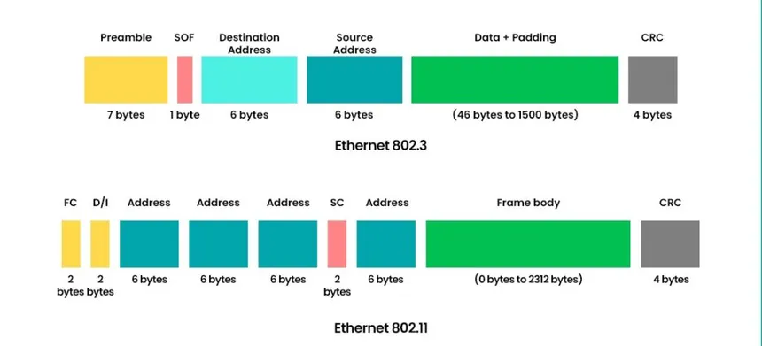
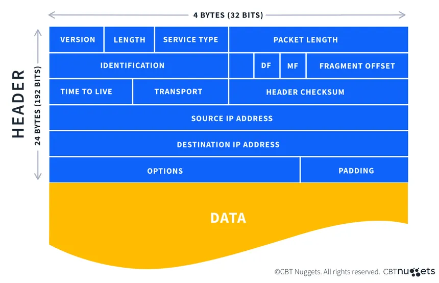
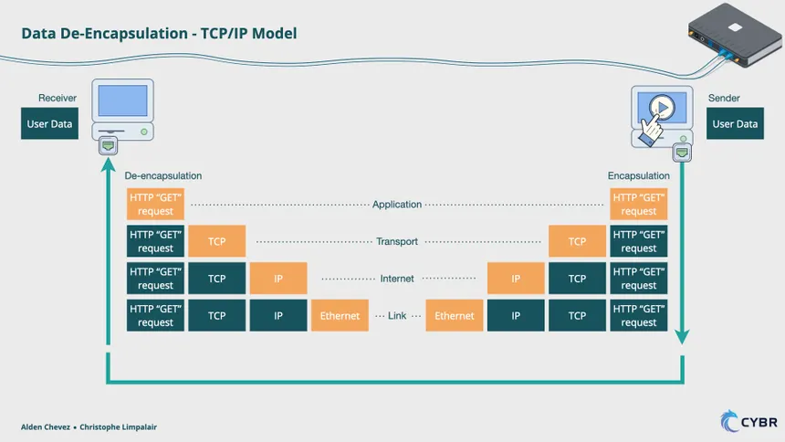
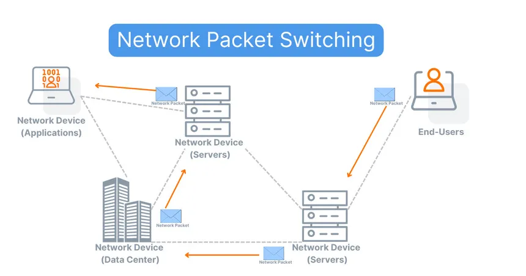

# Data Transmission Core  
(How Data Becomes Bits, Moves Through Networks, and Reaches Its Destination)

Everything in networking and cybersecurity comes down to one thing:  
**moving structured data safely from one system to another.**

This document explains exactly how data is created, packaged, transported, inspected, and delivered in modern networks.

---

# 1. Bits and Bytes – The Physical Language of Networks

Computers do not understand words, images, or files.  
They only understand **electrical or optical signals**.

A **bit** is the smallest unit of data:
- 0 = no signal
- 1 = signal

A **byte** is 8 bits combined.  
Every letter, number, picture, password, or virus is converted into bytes, and then into bits before transmission.

---

# 2. Why Networks Use Frames and Packets

Sending raw bits would be unreliable and impossible to control.  
So networks use structured containers.

There are two main containers:

- **Packet** – Used by the Internet (IP).  
- **Frame** – Used inside local networks (Ethernet, Wi-Fi).

A packet travels across routers.  
A frame carries that packet across switches.

---

# 3. Packets – The Internet’s Delivery Units

A **packet** is the basic unit of data that moves across networks.

Every packet contains:
- Source IP address  
- Destination IP address  
- Protocol (TCP, UDP, ICMP)  
- Data  

Routers forward packets based on the **destination IP address**.

Packets do not care about MAC addresses.  
They only care about where the data must go globally.

---

# 4. Frames – The Local Network Envelopes

A **frame** is how data moves inside a LAN.

A frame contains:
- Source MAC address  
- Destination MAC address  
- The packet  
- Error detection  

Switches forward frames using MAC addresses.

Each time a packet moves to a new network, it is placed inside a **new frame** with new MAC addresses.

---

# 5. Packet Structure

A packet is divided into three parts:

### Header  
Contains control information:
- Source IP
- Destination IP
- Protocol
- Fragment number

### Payload  
Contains the actual data:
- Website
- Login credentials
- File data
- Malware

### Trailer  
Contains integrity checks

Attackers target payloads.  
Firewalls inspect headers.

---

# 6. Encapsulation – Wrapping the Data

Encapsulation is how data moves down the network layers.

When an application sends data:
1. Application creates data  
2. TCP adds port numbers  
3. IP adds addresses  
4. Ethernet adds MAC addresses  
5. Physical layer sends bits  

Each layer wraps the data.

This ensures:
- Correct routing
- Reliable delivery
- Security processing

---

# 7. Decapsulation – Unwrapping the Data

At the receiving device:
1. Ethernet header removed  
2. IP header removed  
3. TCP header removed  
4. Application receives data  

Security devices analyze traffic during this unwrapping process.

---

# 8. Packet Flow Across Networks

When you open a website:

1. Your PC builds a packet  
2. Switch sends it to the router  
3. Router sends it to ISP  
4. Internet routes it to server  
5. Server responds  

At every hop:
- MAC addresses change  
- IP addresses stay the same  

This allows packets to cross the entire world.

---

# 9. Cybersecurity View

Hackers attack:
- Frames (ARP spoofing)
- Packets (IP spoofing)
- Payloads (malware)
- Flow (man-in-the-middle)

Defenders protect:
- Headers
- Payloads
- Paths
- Timing

Firewalls, IDS, VPNs, and Wireshark all operate on frames and packets.

---

# Final Reality

**If you understand how bits become packets and how packets become network traffic, you understand networking and cybersecurity.**
