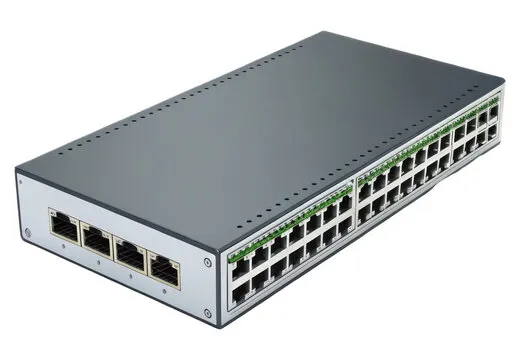
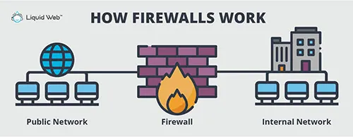
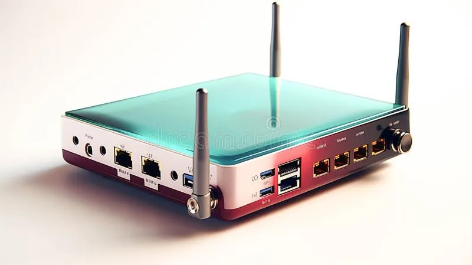
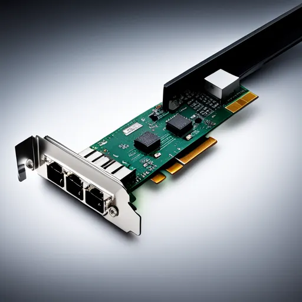
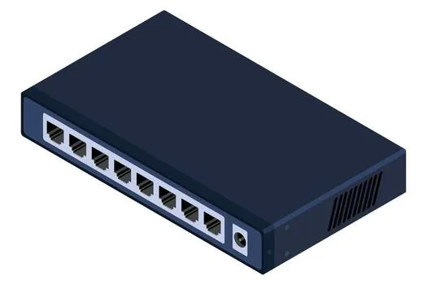
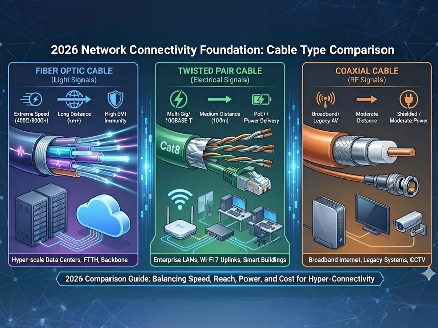

# Network Devices: Computers, Servers, and Key Network Components

In any network, devices are categorized based on their role: **end devices**, **servers**, and **network infrastructure devices**.  
Understanding these is essential for networking, network design, and cybersecurity.

---

## **1. Computers (End Devices)**

### Definition
A computer is a device used by an end-user to access network services and resources.  
It can be a desktop, laptop, smartphone, or any device directly controlled by the user.

### Role in Networks
- Generates and consumes network data
- Connects to servers and other computers
- Communicates over LAN, WAN, or Wi-Fi

### Examples
- Desktops, laptops
- Mobile phones, tablets
- IP phones
- IoT devices (smart cameras, sensors)

### Security Considerations
- **User vulnerabilities:** Endpoints are primary targets for malware, phishing, ransomware.
- **Patching & updates:** Regular OS and application updates reduce risks.
- **Endpoint security:** Antivirus, EDR (Endpoint Detection & Response), and device hardening.

---

## **2. Servers**

### Definition
A server is a dedicated device or software that **provides resources, services, or applications** to other devices (clients).  
Servers are usually high-performance machines optimized for continuous operation.

### Role in Networks
- Hosts applications (web, email, databases)
- Responds to client requests using a **Client–Server model**
- Centralizes management of resources and users

### Examples
- Web servers (HTTP/HTTPS)
- File servers (SMB, FTP)
- Database servers (MySQL, SQL Server)
- Mail servers (SMTP, IMAP, Exchange)
- DNS/DHCP servers

### Security Considerations
- **Access control:** Limit client connections and enforce authentication.
- **Patch management:** Prevent exploits by applying updates.
- **Monitoring:** Logs, alerts, and audit trails.
- **Segmentation:** Place servers in separate VLANs or DMZ to reduce attack surface.
- **Backups:** Regular backups prevent data loss during attacks.

---

## **3. Switches**

### Definition
Switches are Layer 2 devices (Data Link Layer) that forward frames between devices based on MAC addresses.

### Role in Networks
- Connect multiple devices in a LAN
- Learn MAC addresses and forward traffic to correct ports
- Reduce collisions by creating separate broadcast domains per port (on managed switches)

### Security Considerations
- VLAN configuration for segmentation
- Port security (restrict MAC addresses per port)
- Protect against MAC flooding, ARP spoofing

### Examples
- Access switches (for end devices)
- Distribution switches (aggregating multiple access switches)
- Managed vs unmanaged switches

---

## **4. Routers**

### Definition
Routers are Layer 3 devices (Network Layer) that forward IP packets between networks.

### Role in Networks
- Connect different networks (LAN, WAN, Internet)
- Route traffic efficiently using routing tables
- Provide NAT (Network Address Translation) for private networks

### Security Considerations
- Configure ACLs (Access Control Lists) to filter traffic
- Secure routing protocols (OSPF, BGP)
- Monitor for IP spoofing or unauthorized access

---

## **5. Firewalls**

### Definition
A firewall is a network security device that monitors and controls incoming and outgoing traffic based on predetermined security rules.

### Role in Networks
- Blocks unauthorized access
- Protects internal networks from external threats
- Can operate at multiple layers: Packet filtering (Layer 3), Stateful inspection (Layer 4), Application-level (Layer 7)

### Security Considerations
- Regularly update rules and firmware
- Combine with IDS/IPS for detection and prevention
- Monitor logs for anomalies

---

## **6. Modems**

### Definition
A modem (modulator-demodulator) converts digital signals from a computer into analog signals for transmission over phone lines or cable and vice versa.

### Role in Networks
- Provides Internet connectivity
- Connects small office/home networks to ISPs

### Security Considerations
- Change default passwords
- Disable remote management if not needed
- Monitor logs for unauthorized access

---

## **7. Wireless Access Points (WAPs)**

### Definition
WAPs provide Wi-Fi connectivity to devices within a network.

### Role in Networks
- Extend the network into areas without wired connections
- Support multiple simultaneous connections

### Security Considerations
- Use WPA3 encryption
- Implement enterprise authentication (802.1X)
- Disable unused SSIDs
- Monitor for rogue APs (Evil Twin attacks)

---

## **8. Network Interface Cards (NICs)**

### Definition
A NIC is hardware that allows a device to connect to a network.

### Role in Networks
- Provides unique MAC address for identification
- Handles transmission and reception of frames

### Security Considerations
- MAC address filtering can restrict access
- Ensure NIC drivers are updated to prevent exploits

---

## **9. Hubs**

### Definition
A hub is a **basic Layer 1 device** that connects multiple devices in a network.  
It simply **broadcasts incoming data to all connected devices** without filtering.

### Role in Networks
- Connect multiple end devices in a small LAN
- Acts as a simple repeater to extend network signals

### Advantages
- Simple and inexpensive
- Easy to install in small networks

### Disadvantages
- No intelligence → cannot filter traffic
- All traffic is broadcast → higher collisions
- Single point of congestion in larger networks

### Cybersecurity Considerations
- Traffic can be easily intercepted by any connected device
- Rarely used in modern networks due to security and efficiency concerns

---

## **10. Cables**

### Definition
Cables are the **physical medium** that connects network devices and allows data transmission.

### Types
- **Twisted Pair (Ethernet):** Cat5e, Cat6 – widely used in LANs
- **Coaxial:** Older technology, mostly legacy systems
- **Fiber Optic:** High-speed, long-distance, and highly secure transmission

### Role in Networks
- Transmit electrical or light signals between devices
- Determine network speed and reliability

### Advantages
- Twisted pair: cost-effective, easy to install
- Fiber optic: fast, immune to electromagnetic interference, long-distance coverage

### Disadvantages
- Physical damage can disrupt network
- Fiber requires specialized handling and connectors

### Cybersecurity Considerations
- Physical security is critical (tapping cables can leak data)
- Fiber is more secure against eavesdropping than copper
- Ensure proper labeling and management in patch panels

---

## **11. Connectors**

### Definition
Connectors are interfaces used to terminate cables and link them to devices.

### Types
- **RJ-45:** Standard for Ethernet connections
- **LC/SC:** Common for fiber optic connections
- **RJ-11:** Telephone lines

### Role in Networks
- Provide a reliable physical connection between cables and devices
- Enable easy installation, troubleshooting, and reconfiguration

### Cybersecurity Considerations
- Properly secure patch panels and racks
- Avoid loose or exposed connectors that could be tampered with
- Maintain consistent labeling to prevent accidental network misconfigurations

---

## **9. Summary Table (Quick Reference)**

| Device                   | Layer      | Role                                     | Security Focus                                 |
|---------------------------|-----------|-----------------------------------------|-----------------------------------------------|
| Computer / Laptop         | End Device | Generate/consume data                    | Endpoint security, patching, monitoring      |
| Server                    | End Device | Provide resources/services               | ACLs, patching, monitoring, segmentation    |
| Switch                    | Data Link | Forward frames                            | VLANs, port security, MAC/ARP attacks        |
| Router                    | Network   | Route IP packets                          | ACLs, routing security, monitoring           |
| Firewall                  | All       | Control traffic based on policies         | Rules, logging, IPS/IDS integration         |
| Modem                     | Physical  | Connect to ISP                            | Passwords, firmware updates                  |
| Wireless Access Point     | Data Link | Wi-Fi connectivity                        | WPA2/WPA3, authentication, rogue AP detection|
| Network Interface Card    | Physical  | Connect device to network                 | MAC filtering, driver updates                |

---

### **Key Takeaways**

1. **End devices (computers, laptops, phones)** are the entry points and most targeted by attackers.  
2. **Servers** centralize services and are high-value targets.  
3. **Switches and routers** control traffic flow; their misconfiguration can lead to breaches.  
4. **Firewalls and WAPs** protect networks but must be properly configured.  
5. Understanding all devices is **foundational for both networking and cybersecurity practice**.

---

