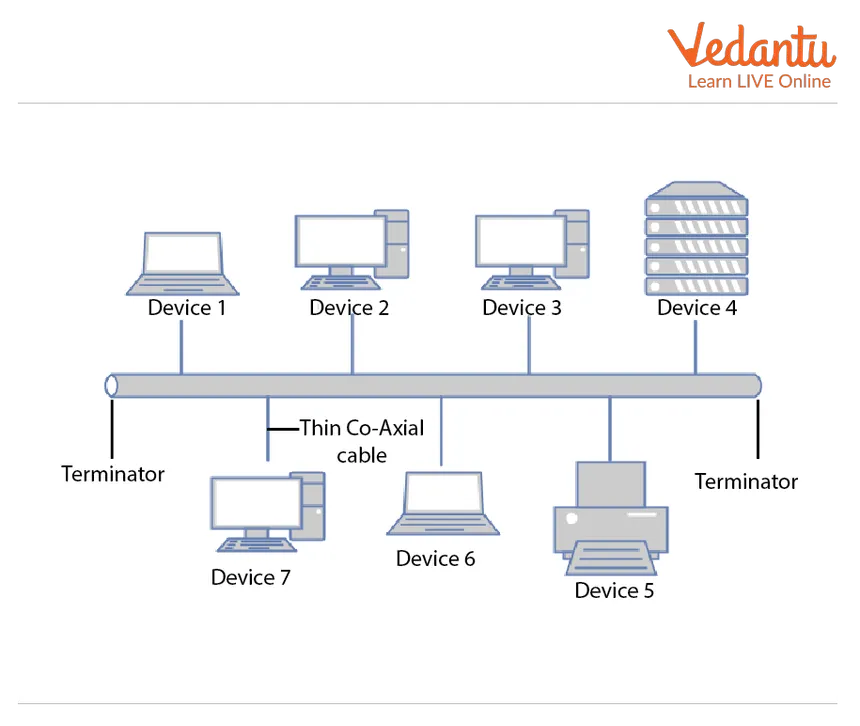
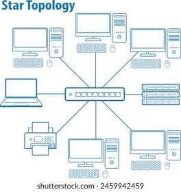
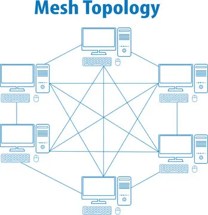
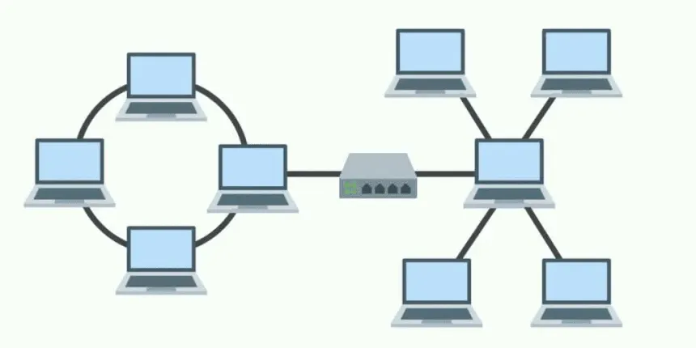

# Network Topologies

Network topologies define how devices are connected and how data flows in a network.  
Understanding topologies is essential for **network design, troubleshooting, and cybersecurity**.

---

## 1. Bus Topology

**Definition:**  
All devices are connected to a single central cable (bus or backbone).  

**Working:**  
- Data travels in both directions along the bus.  
- Devices check each packet; if the address matches, they accept it.  
- Terminators at each end prevent signal reflection.  

**Advantages:**  
- Simple and cost-effective for small networks  
- Requires less cabling  

**Disadvantages:**  
- Single point of failure: if the backbone breaks, the network fails  
- Performance decreases as more devices are added  
- Difficult to troubleshoot in large networks  

**Cybersecurity Considerations:**  
- Data is broadcast to all devices → easier for attackers to sniff traffic  
- Encryption and monitoring recommended  

---

## 2. Star Topology

**Definition:**  
All devices connect to a **central hub or switch** that manages traffic.  

**Working:**  
- Devices communicate through the central hub/switch.  
- The switch forwards traffic only to the correct device using its MAC table.  

**Advantages:**  
- Easy to manage and troubleshoot  
- Failure of one device does not affect others  
- Scalable  

**Disadvantages:**  
- Central hub/switch is a single point of failure  
- More cabling than bus topology  

**Cybersecurity Considerations:**  
- Central switch can be hardened with VLANs and port security  
- Monitoring prevents MAC flooding attacks  
- Segmentation reduces lateral movement  

---

## 3. Ring Topology

**Definition:**  
Each device is connected to exactly **two other devices**, forming a circular path.  

**Working:**  
- Data travels in one or both directions along the ring  
- Each device forwards data to the next device  

**Advantages:**  
- Predictable data flow  
- Minimal collisions in token ring networks  
- Easier fault isolation in unidirectional rings  

**Disadvantages:**  
- Failure of one device/link can disrupt the network  
- Adding/removing devices can temporarily disrupt traffic  

**Cybersecurity Considerations:**  
- Data passes through each device → risk if a node is compromised  
- Redundancy and monitoring are important  

---

## 4. Mesh Topology

**Definition:**  
Every device is connected to every other device (fully or partially).  

**Working:**  
- Data can take multiple paths from source to destination  
- Fully connected mesh ensures maximum availability  

**Advantages:**  
- Highly reliable and fault-tolerant  
- Supports high traffic loads  
- No single point of failure  

**Disadvantages:**  
- Expensive due to cabling and hardware  
- Complex to configure and manage  

**Cybersecurity Considerations:**  
- High redundancy improves resilience to attacks  
- Each connection must be secured with ACLs or encryption  

---

## 5. Hybrid Topology

**Definition:**  
A combination of two or more topologies, e.g., star + bus.  

**Working:**  
- Different sections of the network use different topologies  
- Combines advantages of multiple designs  

**Advantages:**  
- Flexible and scalable  
- Can optimize cost and performance  
- Faults can be isolated to sections  

**Disadvantages:**  
- Complex design and management  
- Requires careful planning of cabling and devices  

**Cybersecurity Considerations:**  
- Multiple topologies mean multiple potential attack points  
- VLANs, segmentation, and monitoring are critical  

---

## 6. Physical vs Logical Topology

**Physical Topology:**  
- Shows the **actual physical layout** of cables and devices  
- Determines installation cost, maintenance, and hardware placement  

**Logical Topology:**  
- Shows **how data flows** through the network  
- Example: a physical star can have a logical bus  

**Cybersecurity Considerations:**  
- Logical flow determines **where attacks can propagate**  
- Physical access to devices and cabling must be secured  

---

## **Key Takeaways**

1. **Topology impacts performance, scalability, and security**.  
2. **Bus** is simple but vulnerable; **star** is scalable; **ring** is predictable; **mesh** is highly available; **hybrid** is flexible.  
3. **Cybersecurity must be considered in every topology**:
   - Data sniffing in bus and ring  
   - Switch hardening and VLANs in star  
   - Encryption and ACLs in mesh and hybrid  
4. **Logical vs physical topology**: always consider both for design and security.

