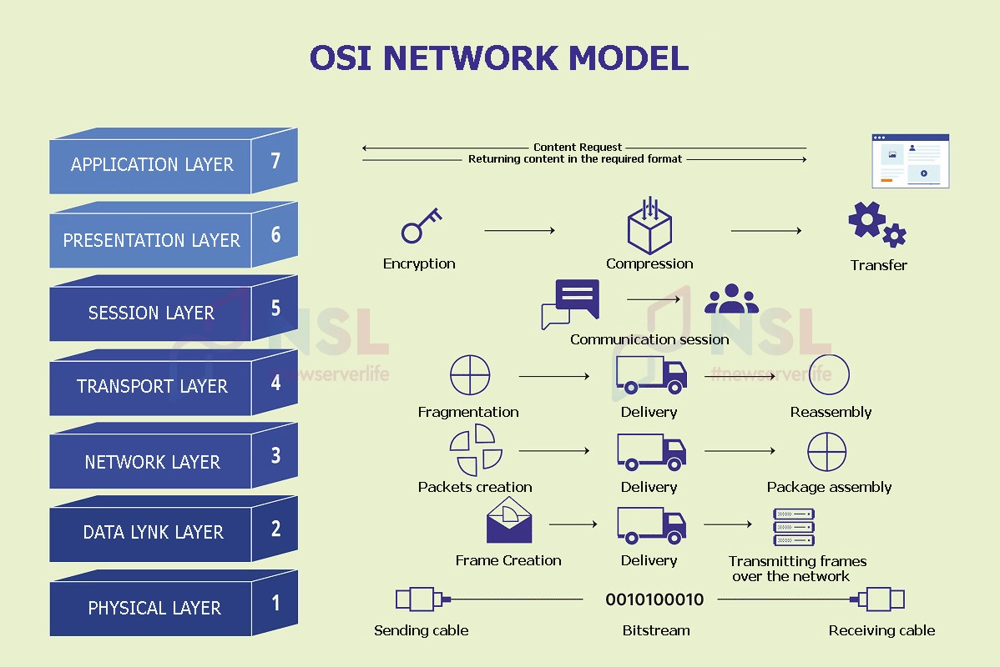

# OSI Model

The OSI (Open Systems Interconnection) model is a **7-layer architectural framework** that defines how data moves from one computer to another across any network.  
It is not a protocol — it is a **design standard** that allows vendors, software, and security systems to interoperate globally.

Every email, web request, VPN tunnel, cloud service, and cyber-attack flows through these layers.

---

# Why the OSI Model Exists

Before OSI, vendors built incompatible networks.  
OSI introduced:
- Standardization  
- Vendor-neutral design  
- Layer-based troubleshooting  
- Security control points  

Each layer performs **one specific job** and passes the result to the next layer.

This separation allows:
- Faster troubleshooting
- Better security design
- Scalable global networking

---

# OSI Layer Architecture Overview

| Layer| Name        | Core Responsibility         |
|------|-------------|--------------------         |
| 7    | Application | User-level network services |
| 6    | Presentation| Data formatting, encryption |
| 5    | Session     | Connection management       |
| 4    | Transport   | End-to-end delivery         |
| 3    | Network     | IP addressing & routing     |
| 2    | Data Link   | MAC addressing & frames     |
| 1    | Physical    | Electrical & radio signals  |

---

# Layer 7 — Application Layer
This is where **applications touch the network**.

It provides network services to:
- Web browsers
- Email clients
- File transfer programs
- APIs
- Remote login tools

It does NOT transmit data — it defines how software **requests** data.

Protocols:
- HTTP / HTTPS
- FTP / SFTP
- SMTP, IMAP, POP3
- DNS
- SSH
- SNMP

Cybersecurity relevance:
- Web hacking
- SQL injection
- XSS
- Credential theft
- Malware delivery

Firewalls, WAFs, and proxies analyze traffic here.

---

# Layer 6 — Presentation Layer
This layer controls **how data looks and how it is protected**.

It performs:
- Encryption (TLS, SSL)
- Decryption
- Compression
- Character encoding
- File formatting

Without this layer:
A Linux server and Windows PC could not read the same data.

Security role:
- Encrypts sensitive information
- Prevents data leaks
- Protects against packet sniffing

---

# Layer 5 — Session Layer
This layer manages **conversations between devices**.

It:
- Establishes sessions
- Maintains them
- Synchronizes data streams
- Closes connections

Example:
Logging into a website and staying logged in.

Security relevance:
- Session hijacking
- Cookie theft
- Token abuse
- Replay attacks

---

# Layer 4 — Transport Layer
This layer guarantees **data delivery between two systems**.

It controls:
- Port numbers
- Data segmentation
- Flow control
- Error correction

Protocols:
- TCP — reliable, ordered
- UDP — fast, no guarantees

Security role:
- Port scanning
- DDoS attacks
- Firewall filtering
- Malware C2 channels

---

# Layer 3 — Network Layer
This is where **the Internet exists**.

It handles:
- IP addressing
- Packet routing
- Path selection
- Network segmentation

Protocols:
- IP
- ICMP
- IPsec
- Routing protocols (BGP, OSPF)

Security:
- VPNs
- Firewalls
- IP spoofing protection
- Geolocation filtering

---

# Layer 2 — Data Link Layer
This layer moves data **inside a local network**.

It controls:
- MAC addresses
- Ethernet frames
- Switching
- VLANs

Protocols:
- Ethernet
- Wi-Fi
- ARP
- 802.1Q

Security threats:
- ARP poisoning
- MAC spoofing
- VLAN hopping

---

# Layer 1 — Physical Layer
This is the **real world**:
- Cables
- Fiber
- Wi-Fi signals
- Voltages

Security:
- Wire tapping
- Hardware attacks
- Physical access

---

# OSI Model in Cybersecurity

Security tools map directly to OSI layers:

| Tool      | OSI Layer |
|-----------|-----------|
| Firewall  | 3–4       |
| VPN       | 3         |
| IDS/IPS   | 2–7       |
| WAF       | 7         |
| TLS       | 6         |

---

# Final Truth

The OSI model is the **map of digital reality**.

If you understand OSI deeply, you can:
- Design networks
- Analyze packets
- Build firewalls
- Break systems
- Defend enterprises
