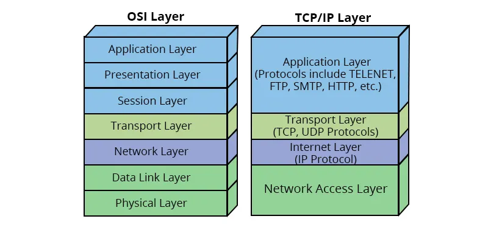

# OSI Model vs TCP/IP Model

Both OSI and TCP/IP describe how data moves through a network, but they serve **different purposes**.

The **OSI model** is a **conceptual learning and design model**.  
The **TCP/IP model** is a **practical implementation model** used by the Internet.

---

## 1. Purpose

**OSI Model**
- Created to **standardize and explain** how networks work.
- Used for **learning, troubleshooting, and design**.
- Provides a very **detailed breakdown** of networking functions.

**TCP/IP Model**
- Created to **make real networks work**.
- Used to **build and operate the Internet**.
- Focused on **data transmission, routing, and reliability**.

OSI explains *how networking should be structured*.  
TCP/IP defines *how networking actually works*.

---

## 2. Layer Structure

OSI has **7 layers**:
Physical, Data Link, Network, Transport, Session, Presentation, Application

TCP/IP has **4 layers**:
Network Access, Internet, Transport, Application

TCP/IP combines multiple OSI layers to keep the system simpler and more efficient.

---

## 3. Design Philosophy

OSI was designed as a **theoretical reference model**.  
Each layer has a very specific role.

TCP/IP was designed as an **engineering model**.  
Its goal is to move data reliably across real networks.

OSI = structured and educational  
TCP/IP = practical and operational

---

## 4. Protocol Support

OSI defines **what each layer should do** but does not define real-world protocols.

TCP/IP is built around real protocols:
- HTTP, FTP, DNS (Application)
- TCP, UDP (Transport)
- IP, ICMP (Internet)
- Ethernet, Wi-Fi (Network Access)

All modern networks follow TCP/IP, not OSI.

---

## 5. Troubleshooting Use

Engineers use the **OSI model** to identify where a problem exists:
- Physical cable issue
- IP routing problem
- Application error

TCP/IP is used to **fix the problem**, because it controls how data is actually sent.

OSI helps locate problems.  
TCP/IP controls the data flow.

---

## 6. Cybersecurity Perspective

Attack mapping uses OSI:
- Layer 1–2: Physical and Wi-Fi attacks
- Layer 3–4: IP spoofing, port scans
- Layer 7: Web exploits, malware, phishing

Security tools operate on TCP/IP:
- Firewalls
- VPNs
- IDS/IPS
- Encryption

OSI explains **where** attacks happen.  
TCP/IP defines **how** attacks travel.

---

## Final Summary

OSI is a **blueprint**.  
TCP/IP is the **engine**.

OSI is used to **understand networks**.  
TCP/IP is used to **run networks**.

A cybersecurity professional must know **both**:
OSI to analyze attacks,  
TCP/IP to defend against them.
