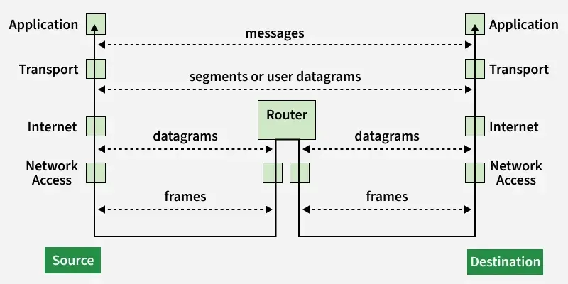

# TCP/IP Model

The TCP/IP model is the **foundation of the Internet**.  
It defines how data is created, transmitted, routed, and received across networks.

Every website, email, cloud service, and cyber-attack follows this model.

---

## 1. Application Layer

This layer is where **user-facing network services** operate.  
It provides rules that applications use to communicate over a network.

It handles:
- Data formatting
- Authentication
- Encryption
- Session control

When a browser loads a website, this layer creates the HTTP or HTTPS request and processes the response.

**Common protocols**
- HTTP / HTTPS  
- FTP, SFTP  
- SMTP, IMAP  
- DNS  
- SSH  

**Security relevance**
Most cyber-attacks target this layer: phishing, web exploits, malware downloads, and API abuse.

---

## 2. Transport Layer

This layer ensures data reaches the **correct application** on the destination system.

It introduces:
- Port numbers
- Sessions
- Reliable delivery

**TCP**
- Reliable
- Ordered
- Used for web, email, file transfer

**UDP**
- Fast
- No delivery guarantee
- Used for streaming, DNS, gaming

**Security relevance**
Firewalls, intrusion detection, and port scanning operate at this layer.

---

## 3. Internet Layer

This layer handles **IP addressing and routing** across networks.

It ensures packets reach the correct destination across multiple routers and networks.

**Key protocols**
- IP (IPv4, IPv6)
- ICMP
- IPsec
- Routing protocols (BGP, OSPF)

**Security relevance**
VPNs, IP filtering, geoblocking, and spoofing attacks occur here.

---

## 4. Network Access Layer

This layer controls **local network communication and physical transmission**.

It manages:
- Ethernet and Wi-Fi
- MAC addresses
- Frames
- Switches and cables

It ensures devices on the same network can find and communicate with each other.

**Security relevance**
Packet sniffing, Wi-Fi attacks, ARP poisoning, and rogue devices target this layer.

---

## How TCP/IP Works

When data is sent:
Application → Transport → Internet → Network Access  

When data is received:
Network Access → Internet → Transport → Application  

Each layer adds or removes its own information to move data safely and correctly.

---

## Why TCP/IP Matters for Cybersecurity

Every network attack, firewall rule, VPN tunnel, and cloud service operates inside this model.  
Understanding TCP/IP means understanding **how data moves and how attackers exploit it**.

